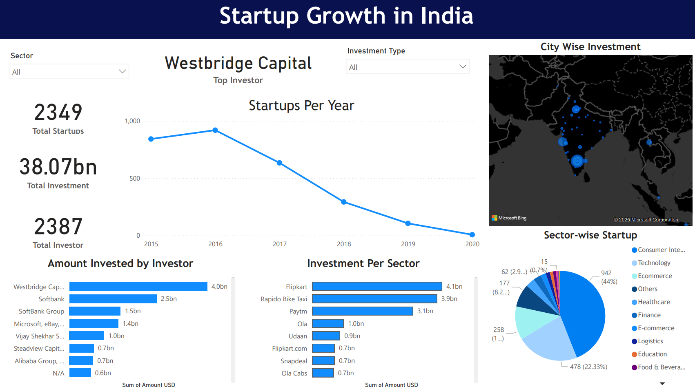

# 🚀 Indian Startup Analysis Dashboard - Power BI

A Data-Driven Storytelling Dashboard to analyze the growth, funding trends, and success vs failure pattern of Startups in India 🇮🇳

---

## 📊 Project Overview

This Power BI Dashboard provides insights into the Indian Startup Ecosystem — revealing:

- Total Number of Startups Founded
- Total Investment Raised (USD)
- Top Cities with Maximum Startups
- Top Investors over Time
- Industry-wise Startup Distribution
- Year-wise Startup Trend
- Failure vs Success Sector Analysis

---

## 📁 Dataset Source
- Startup Dataset from [Kaggle / Govt Open Data Platform / Your Source]  
- Columns Used:  
`Startup Name`, `Industry Vertical`, `City`, `Investment Type`, `Investors`, `Amount Raised`, `Date`

---

## 💡 Key Features of Dashboard

- Time-based Top Investor Filter  
*(Select Year/Month — It will show "Top Investor" dynamically like Westbridge Capital)*  
- Interactive Filters for City, Industry, Investment Type  
- Clean & Modern UI Design with Dark Theme  
- Sector-wise Startup Success & Failure Insights  
- Total Funding Raised Trend (Line Chart)
- City-wise Startups Heatmap

---

## 🛠 Tools Used

| Tool        | Purpose          |
|-------------|-----------------|
| Power BI    | Data Modeling, Visualization |
| DAX         | Measures & KPIs Calculation |
| GitHub      | Project Hosting |
| Excel / CSV | Data Cleaning |

---

## 📷 Dashboard Preview

### You can try it with the following link:
**[Dashboard Live](Startup.pbix)** 

 

---

## 🤝 Let's Connect

If you liked this project, do give it a ⭐ on GitHub.

Connect with me on:

- [LinkedIn](https://www.linkedin.com/in/manish-sharma-55013a222/)
- [GitHub](https://github.com/manishsarmaa)

---

## Future Scope 🚀

- Add Success vs Failure prediction using Machine Learning  
- Real-time Startup News API Integration  
- Drill-Through Pages for Investors Analysis  

---

> Made with ❤️ in India 🇮🇳 | Powered by Power BI
